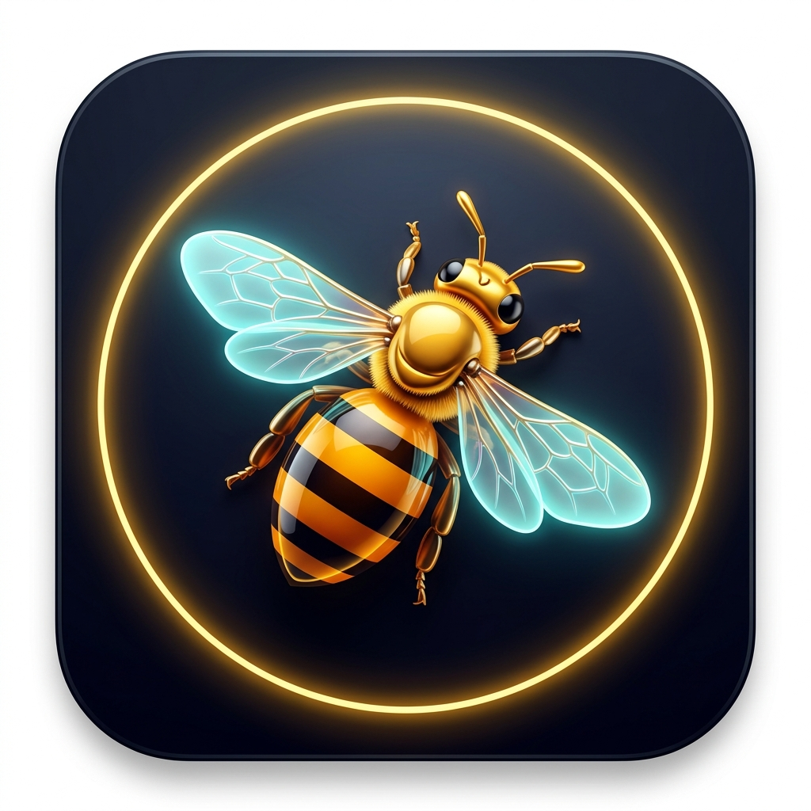

# 🐝 VisionCraft - Digital Image Processing (DIP) Studio & Web Photoshop

<p align="center">
  
</p>

<p align="center">
  <b>استوديو ويب احترافي ومتكامل لمعالجة الصور الرقمية وتطبيق الخوارزميات الرياضية بتجربة مستخدم تحاكي Adobe Photoshop</b><br>
  <i>A Full-Featured Photoshop-like Web Studio & Digital Image Processing Engine powered by Laravel 11, Python Microservice, OpenCV & HTML5 Canvas</i>
</p>

<p align="center">
  
  
  
  
  
  
  
</p>

> [!IMPORTANT]
> ### 🔒 إشعار الحفظ الأكاديمي وحماية الملكية الفكرية (Academic Integrity Notice)
> هذا المستودع مخصص كـ **معرض أعمال وتوثيق هندسي (Project Architecture & Documentation Showcase)** لمشروع معالجة الصور الرقمية (DIP Studio).
> 
> **لحماية الملكية الفكرية ومنع الانتحال الأكاديمي (Plagiarism) قبل موعد التقييم النهائي:**
> - يتم الاحتفاظ بالكود المصدري الكامل للمحرك الرياضي (Python Flask Microservice) ومتحكمات لارافل وخوارزميات المعالجة في مستودع خاص (Private Repository).
> - يُمنع منعاً باتاً نسخ أو اقتباس هذا العمل لتقديمه كمشروع جامعي دون إذن خطي من المطور.
> - **للأساتذة والمقيمين الأكاديميين ومسؤولي التوظيف:** للاطلاع على الكود المصدري الكامل وإجراء مراجعة تقنية، يُرجى التواصل مباشرة مع صاحب المشروع:
>   - **المطور:** أحمد القاضي (Ahmed Al-Qadi)
>   - **البريد الإلكتروني:** `ahmedalqadi374@gmail.com`
>   - **GitHub Profile:** [@Ahmed-Alqadi](https://github.com/Ahmed-Alqadi)

---

## 📑 جدول المحتويات (Table of Contents)
- [نبذة عن المشروع (About)](#-نبذة-عن-المشروع-about)
- [معمارية النظام (System Architecture)](#-معمارية-النظام-system-architecture)
- [الميزات والقدرات الفائقة (DIP Superpowers)](#-الميزات-والقدرات-الفائقة-dip-superpowers)
- [هيكل ومجلدات المشروع (Project Structure)](#-هيكل-ومجلدات-المشروع-project-structure)
- [متطلبات التشغيل (Prerequisites)](#-متطلبات-التشغيل-prerequisites)
- [طريقة التثبيت والتشغيل خطوة بخطوة (Quick Start)](#-طريقة-التثبيت-والتشغيل-خطوة-بخطوة-quick-start)
- [توثيق واجهة البرمجة (API Documentation)](#-توثيق-واجهة-البرمجة-api-documentation)
- [إدارة المشروع ومهام الفريق (Team & Git Workflow)](#-إدارة-المشروع-ومهام-الفريق-team--git-workflow)
- [الترخيص (License)](#-الترخيص-license)

---

## 🌟 نبذة عن المشروع (About)
تم تصميم وتطوير مشروع **VisionCraft DIP Studio** وفق أفضل معايير هندسة البرمجيات (Software Engineering Best Practices) لتقديم أداة شاملة وتفاعلية للطلاب والباحثين والمصممين لتطبيق خوارزميات **معالجة الصور الرقمية (Digital Image Processing - DIP)** ومقارنة النتائج الحسابية بصرياً وفورياً داخل المتصفح.

النظام مبني بمعمارية **الخدمات المصغرة (Microservices Architecture)** التي تفصل واجهة المستخدم والتحكم عن المحرك الحسابي الثقيل لضمان أعلى مستويات الأداء والمرونة وسهولة الصيانة.

---

## 🏗️ معمارية النظام (System Architecture)

```
┌────────────────────────────────────────────────────────────────────────┐
│                   Frontend Client (Web Photoshop UI)                   │
│   • Interactive HTML5 Dual Canvas (Raw vs Processed Dual-Split)        │
│   • 7x7 Live Numeric Pixel Matrix Loupe Inspector HUD                  │
│   • Live RGB/Luminance Histogram & Statistical Metrics Engine          │
│   • Drawing Suite & Crop Overlay & Layers Stack Management             │
└───────────────────────────────────┬────────────────────────────────────┘
                                    │ HTTP Fetch / AJAX
                                    ▼
┌────────────────────────────────────────────────────────────────────────┐
│                   Laravel 11 Backend & API Gateway                     │
│   • Port: 8000                                                         │
│   • Route Dispatcher (routes/api.php, routes/web.php)                  │
│   • Controller: ImageProcessingController.php                          │
│   • Forwarding, Payload Validation & Response Handling                 │
└───────────────────────────────────┬────────────────────────────────────┘
                                    │ HTTP Proxy (POST /process)
                                    ▼
┌────────────────────────────────────────────────────────────────────────┐
│                   Python DIP Microservice (Flask Engine)               │
│   • Port: 5001                                                         │
│   • Libraries: OpenCV, NumPy, SciPy, Pillow, Flask-CORS                │
│   • Core Pipeline:                                                     │
│     ├── Point Operations (Gamma, CLAHE, Log, Threshold, Otsu)          │
│     ├── Spatial Filters (Gaussian, Median, Wiener, Bilateral)          │
│     ├── Edge Detectors (Canny, Sobel, Prewitt, Laplacian, Unsharp)     │
│     ├── Frequency Domain (2D-FFT Spectrum, Interactive Notch Filter)   │
│     ├── Mathematical Morphology (Erosion, Dilation, Opening, Closing)  │
│     ├── Color Spaces & Segmentation (Grayscale, HSV, LAB, K-Means)     │
│     └── Composition (Dual Blending, Photo Collage, GrabCut AI Cutout)  │
└────────────────────────────────────────────────────────────────────────┘
```

---

## ⚡ الميزات والقدرات الفائقة (DIP Superpowers)

### 1. واجهة مستخدم تحاكي Adobe Photoshop (Photoshop Web UI)
* **المقارنة التفاعلية (Dual-Split Slider):** سحب شريط المقارنة لعرض الصورة الأصلية والصورة المعالجة جنباً إلى جنب بنسب مئوية حرة (0% إلى 100%).
* **مجهر مصفوفة البكسلات المباشر (7×7 Pixel Matrix HUD):** نافذة تفتيش مكبرة تفحص 49 بكسلاً في جوار مؤشر الماوس لحظياً وتعرض قيم الـ RGB ومقدار التدرج التفاضلي ($\Delta Edge$).
* **مخطط الهستوغرام الحسابي (Live Histogram):** رسم بياني فوري لقنوات الإضاءة مع حساب المؤشرات الإحصائية:
  * المتوسط الحسابي (Mean)
  * الانحراف المعياري (Standard Deviation)
  * الوسيط (Median)
  * الإنتروبيا والمعلوماتية (Entropy)
* **لوحة الطبقات (Layers Panel):** التحكم في رؤية الطبقة، نمط الدمج (Blend Modes: Screen, Multiply, Color Dodge)، ونسبة الشفافية (Opacity).

### 2. كشف الحواف والمشتقات (Edge Detection & Derivatives)
* **Canny Multi-stage Edge Detector:** كاشف الحواف الأمثل بمرشح غاوسي وقمع غير النهايات العظمى والعتبة المزدوجة بالربط.
* **Sobel Gradient:** حساب المشتقات المكانية الأولى بالاتجاهين الأفقي والرأسي ($G_x + G_y$).
* **Prewitt Edge Filter:** مرشح التدرج المصفوفي السريع.
* **Laplacian ($∇²f$):** مشتقات الرتبة الثانية لكشف التقاطعات الصفرية.
* **Unsharp Masking (High-Boost):** تعزيز التباين وإبراز تفاصيل الحواف الدقيقة.

### 3. التنعيم وإزالة الضوضاء والاستعادة (Restoration & Denoising)
* **Gaussian Blur O(2K):** مرشح جاوس القابل للفصل لتقليل التعقيد الحسابي.
* **Median Filter:** إزالة ضوضاء الملح والفلفل (Salt & Pepper Noise) بكفاءة مع الحفاظ على الحواف.
* **Adaptive Wiener Filter (MMSE):** مرشح الخطأ التربيعي المتوسط الأدنى لتقدير الإشارة النقية.
* **Bilateral Filter:** مرشح ثنائي الأبعاد يحفظ تدرجات الحواف مع تنعيم المناطق المتجانسة.
* **Motion Deblur (Wiener PSF Restoration):** فك الالتفاف وإلغاء ضباب الحركة عبر دالة توزيع النقطة (PSF).

### 4. مجال الترددات وتحويل فورييه (Fourier 2D-FFT)
* **2D-FFT Magnitude Spectrum:** عرض طيف القدرة والترددات المركزية في فضاء فورييه ثنائي الأبعاد.
* **Interactive Notch Reject Filter:** نافذة تفاعلية تتيح النقر على بؤر التردد الدوري (Spikes) وإزالتها لتصفية تشويش خطوط المواريه (Moiré Effect).
* **Gaussian Low-Pass & High-Pass:** تمرير الترددات المنخفضة للتنعيم أو العالية لإبراز التفاصيل الدقيقة.

### 5. المورفولوجيا الرياضية (Mathematical Morphology)
* **التآكل (Erosion $A \ominus B$) والتمدد (Dilation $A \oplus B$).**
* **الفتح (Opening $A \circ B$):** تنعيم الحدود وإزالة النتوءات الدقيقة.
* **الإغلاق (Closing $A \bullet B$):** سد الفجوات والثغرات ودمج الأشكال المتجاورة.
* **الهيكل العظمي (Skeletonization / Thinning):** تجريد الأشكال الثنائية إلى خطوطها المحورية.

### 6. العمليات النقطية ومساحات الألوان (Point Operations & Color Spaces)
* **تسوية الهستوغرام (Global Equalization & Adaptive CLAHE):** توزيع تباين الإضاءة وتحسين الرؤية في الصور المعتمة.
* **تصحيح جاما (Power-Law $s = cr^\gamma$):** توسيع أو ضغط مستويات الإضاءة.
* **التحويل اللوغاريتمي ($s = c \log(1+r)$):** إظهار التفاصيل المعتمة في النطاقات الديناميكية العالية.
* **العتبة التلقائية (Otsu Thresholding):** حساب القيمة الفاصلة المثلى تلقائياً عبر تعظيم التباين بين الفئات.
* **فضاءات الألوان:** التحويل بين RGB و Grayscale و HSV و CIE L\*a\*b\* مع عزل القنوات المستقلة.
* **تجميع الألوان (K-Means Clustering):** استخراج لوحة الألوان السائدة وتقسيم الصورة دلالياً.

### 7. أدوات الاستوديو والتأليف المتقدم (Studio Composition)
* **دمج صورتين (DIP Image Blending):** استيفاء خطي نسبي خاضع للمعادلة:
  $$g(x, y) = (1 - \alpha) \cdot f_1(x, y) + \alpha \cdot f_2(x, y)$$
* **صانع شبكات الكولاج (Collage Grid):** قوالب مصفوفية جاهزة (صورتين، 3 صور، شبكة 2×2، شريط بانوراما) مع التحكم في سماكة ولون الفواصل والاقتصاص الذكي (Aspect-Fill).
* **استوديو المنتجات وتفريغ الخلفية (GrabCut AI):** قص العناصر بدقة واستبدال الخلفيات بخلفيات استوديو رخامية وخشبية جاهزة أو ألوان صلبة.
* **أداة القص (Interactive Crop Box):** بنسب حرة أو قياسية (1:1, 16:9, 4:3).
* **جناح الرسم والكتابة (Drawing Suite & Typography):** رسم حر، أشكال هندسية (مستطيل، دائرة، أسهم)، وإضافة نصوص قابلة للتخصيص.
* **تصدير متعدد الصيغ (Multi-Format Export):** دعم الحفظ والتصدير بجودة عالية بصيغ PNG و JPG و WEBP و BMP.

---

## 📁 هيكل ومجلدات المشروع (Project Structure)

```text
Studio_Image_SE/
├── app/
│   └── Http/Controllers/
│       └── ImageProcessingController.php  <-- المتحكم الوسيط في لارافل
├── bootstrap/                             <-- ملفات تشغيل لارافل
├── config/                                <-- إعدادات التطبيق وقواعد البيانات
├── database/                              <-- قواعد البيانات ومخططات الجداول
├── docs/                                  <-- وثائق هندسة البرمجيات
│   ├── SRS.md                             <-- مواصفات المتطلبات البرمجية
│   └── RISK_MANAGEMENT.md                 <-- سجل وإدارة المخاطر
├── public/                                <-- الأصول الثابتة
│   ├── accessories/                       <-- عناصر نظارات وبدلات الـ AR
│   ├── backgrounds/                       <-- خلفيات الاستوديو لعرض المنتجات
│   ├── css/                               <-- ملفات التنسيق (photoshop.css, gestures.css)
│   ├── js/                                <-- محرك الجافاسكربت (app.js)
│   ├── samples/                           <-- صور الاختبار والأنماط المعيارية
│   └── bee_logo.png                       <-- شعار الاستوديو
├── python_engine/                         <-- المحرك الحسابي والخدمة المصغرة
│   ├── app/
│   │   └── server.py                      <-- خادم Flask (المنفذ 5001)
│   ├── core/                              <-- خوارزميات معالجة الصور الرقمية
│   │   ├── base.py                        <-- الفئة الأساسية للعمليات
│   │   ├── color_spaces.py                <-- فضاءات الألوان و K-Means
│   │   ├── composition.py                 <-- الدمج والكولاج واستبدال الخلفية
│   │   ├── edge_detectors.py              <-- كواشف الحواف (Canny, Sobel)
│   │   ├── frequency_ops.py               <-- تحويل فورييه 2D-FFT وفلتر Notch
│   │   ├── geometric_ops.py               <-- التدوير وتغيير الأبعاد
│   │   ├── morphology.py                  <-- العمليات المورفولوجية والهيكل
│   │   ├── point_ops.py                   <-- العمليات النقطية وتصحيح جاما
│   │   ├── restoration.py                 <-- استعادة الصور ومرشح وينر
│   │   └── spatial_filters.py             <-- المرشحات المكانية والتنعيم
│   └── requirements.txt                   <-- حزم بايثون المطلوبة
├── resources/
│   ├── css/                               <-- تنسيقات Tailwind
│   └── views/
│       └── welcome.blade.php              <-- قالب الواجهة الرسومية الرئيسي
├── routes/
│   ├── api.php                            <-- مسارات واجهة برمجة التطبيقات
│   └── web.php                            <-- مسار عرض الواجهة الرئيسية
├── artisan                                <-- أداة سطر أوامر لارافل
├── composer.json                          <-- حزم بيئة PHP ولارافل
├── package.json                           <-- حزم الواجهة الأمامية و Vite
├── vite.config.js                         <-- إعدادات مجمع الأصول Vite
└── README.md                              <-- هذا الملف التعريفي الشامل
```

---

## 🛠️ متطلبات التشغيل (Prerequisites)

للتأكد من عمل النظام بكل ميزاته، تأكد من تثبيت الحزم التالية على جهازك:
* **PHP:** الإصدار 8.2 أو أحدث (يوصى باستخدام [Laravel Herd](https://herd.laravel.com/) على الويندوز).
* **Composer:** الإصدار 2.0 فما فوق.
* **Python:** الإصدار 3.10 فما فوق.
* **Node.js & NPM:** (اختياري لبناء حزم Vite وتحديث التنسيقات).

---

## 🚀 طريقة التثبيت والتشغيل خطوة بخطوة (Quick Start)

### 1. استنساخ المستودع (Clone Repository)
```bash
git clone https://github.com/hrnafifgit/Studio_Image_SE.git
cd Studio_Image_SE
```

### 2. تشغيل محرك بايثون الرياضي (Python Microservice)
افتح نافذة موجه أوامر (Terminal)، وانتقل لمجلد المحرك:
```bash
cd python_engine

# إنشاء البيئة الافتراضية
python -m venv venv

# تفعيل البيئة (Windows)
venv\Scripts\activate

# تثبيت الاعتماديات
pip install -r requirements.txt

# تشغيل خادم المحرك
python app/server.py
```
> ✅ سيبدأ المحرك بالعمل والاستماع على المنفذ: `http://127.0.0.1:5001`.

### 3. إعداد وتشغيل سيرفر لارافل (Laravel Server)
افتح نافذة موجه أوامر (Terminal) ثانية في المجلد الرئيسي للمشروع:
```bash
# تثبيت حزم PHP
composer install

# نسخ ملف البيئة وتوليد مفتاح التطبيق
cp .env.example .env
php artisan key:generate

# تشغيل خادم لارافل
php artisan serve
```
> ✅ سيبدأ خادم الويب بالعمل على المنفذ: `http://127.0.0.1:8000`.

### 4. فتح الاستوديو في المتصفح
افتح المتصفح وانتقل إلى الرابط:
👉 **[http://127.0.0.1:8000](http://127.0.0.1:8000)**

---

## 🔌 توثيق واجهة البرمجة (API Documentation)

### نقطة معالجة الصور الرئيسية: `POST /api/process`

تستقبل هذه النقطة طلبات الواجهة وترسلها إلى محرك بايثون بالصيغة التالية:

```json
{
  "image": "data:image/png;base64,iVBORw0KGgoAAAANSUhEUgAA...",
  "operation": "canny",
  "params": {
    "t1": 50,
    "t2": 150,
    "sigma": 1.4
  }
}
```

#### الاستجابة (Response):
```json
{
  "success": true,
  "processed_image": "data:image/png;base64,...",
  "execution_time_ms": 32.4,
  "stats": {
    "mean": 128.4,
    "std": 45.2,
    "median": 130,
    "entropy": 7.42
  }
}
```

---

## 👥 إدارة المشروع ومهام الفريق (Team & Git Workflow)

تم بناء المشروع بالتعاون بين فريق هندسة البرمجيات مقسماً كالتالي:

| الدور | المسؤوليات والملفات | الفرع المخصص (Git Branch) |
| :--- | :--- | :--- |
| **Backend & DIP Engine** | بناء متحكمات لارافل، تطوير خوارزميات OpenCV/NumPy في بايثون، وربط نقاط الـ API. | `feature/backend-engine` |
| **Frontend & UI/UX** | تصميم وبناء واجهة فوتوشوب، أدوات الـ Canvas، التفاعل، الـ AJAX، وإدارة الطبقات. | `feature/frontend-studio` |
| **QA & Documentation** | إعداد وثائق الـ SRS، مصفوفة المخاطر، مخططات UML، واختبارات الجودة. | `docs/system-documentation` |

---

## 📄 الترخيص (License)
هذا المشروع مرخص بموجب رخصة **MIT License** - راجع ملف الترخيص للتفاصيل.
